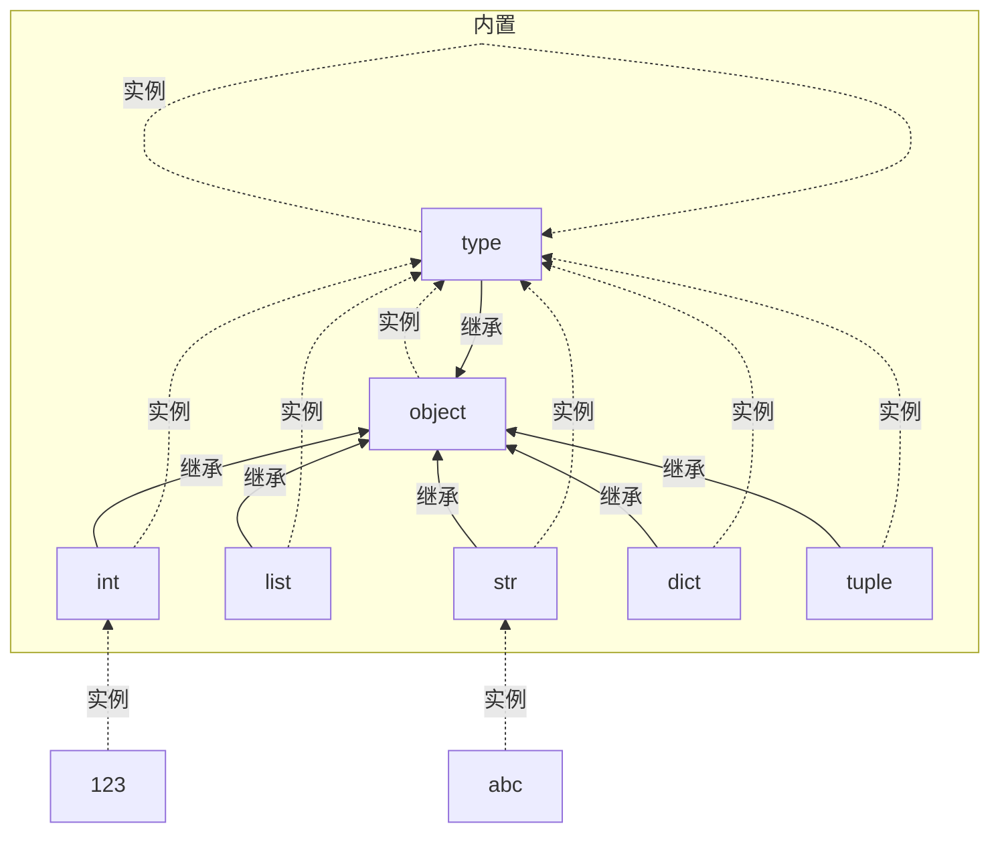

# type、object 和 class 的关系

```mermaid
graph BT;
    subgraph 内置
        type --继承--> object;
        type -.实例.-> type;
        object -.实例.-> type;
        int --继承--> object; 
        int -.实例.-> type;
        list --继承--> object; 
        list -.实例.-> type;
        str --继承--> object; 
        str -.实例.-> type;
        dict --继承--> object; 
        dict -.实例.-> type;
        tuple --继承--> object;
        tuple -.实例.-> type;
    end
    123 -.实例.-> int;
    abc -.实例.-> str;
```