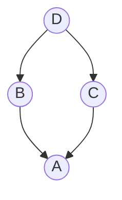
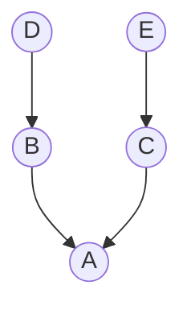

# 类属性和实例属性以及查找顺序

!!! note "说明"
    - MRO: Method Resolution Order 
    
    MRO 是在继承中使用的一个概念。它是在类层次结构中搜索方法的顺序，因为 Python 支持多重继承，所以，在 Python 类的设计及排错中特别有用。
    
    - DFS
    - BFS
    - C3

### 示例一



### 查找顺序

- 深度优先查找：A->B->D->C (错误)
- 广度优先查找：A->B->C->D (正确)

### 深度优先查找的局限性
如果C重载了D的某个方法(B没有重载该方法), 由于深度优先的原则，B之后会优先查找D，结果将会使用D中的方法, 这是不合理的。

### 示例二



### 查找顺序
- 深度优先查找：A->B->D->C->E (正确)
- 广度优先查找：A->B->C->D->E (错误)

### 广度优先查找的局限性
由于继承关系, B和D应该视为一个整体, B中查找不到相应方法，应该优先从其父类D中查找中, 但是由于广度优先, B之后会查找C，这时，如果C和D中定义了同名的方法, 最终结果将会使用C中的方法, 这是不合理的。


## C3算法

```python
# 新式类
class D:
    pass

class E:
    pass

class C(E):
    pass

class B(D):
    pass

class A(B, C):
    pass

print(A.__mro__)
#---------------------------------------
# A -> B -> D -> C -> E
(<class '__main__.A'>, <class '__main__.B'>, <class '__main__.D'>, <class '__main__.C'>, <class '__main__.E'>, <class 'object'>)
```


```python
class D:
    pass

class C(D):
    pass

class B(D):
    pass

class A(B, C):
    pass

print(A.__mro__)
#---------------------------------------
# A -> B -> C -> D
(<class '__main__.A'>, <class '__main__.B'>, <class '__main__.C'>, <class '__main__.D'>, <class 'object'>)
```

## 拓展阅读
- [The Python 2.3 Method Resolution Order](https://www.python.org/download/releases/2.3/mro/)

<!-- - [Python Multiple Inheritance](https://www.programiz.com/python-programming/multiple-inheritance) -->
<!-- https://www.cnblogs.com/Cwj-XFH/p/13166808.html -->
<!-- http://www.srikanthtechnologies.com/blog/python/mro.aspx -->
<!-- https://zhuanlan.zhihu.com/p/33797911 -->